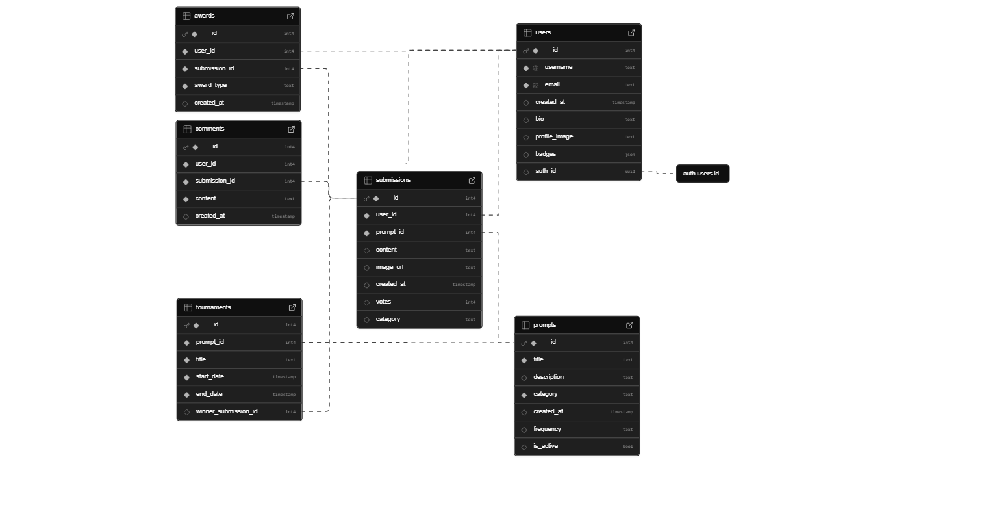

# Muse: Creative Community Prompt App

**Technologies and Features:** Kotlin (Jetpack Compose in Android Studio), Supabase, ImgurAPI, Camera Sensor

**Team Members:** Jeremy Lau, Rudolf Rissling

**[Project Proposal Presentation](https://docs.google.com/presentation/d/1y1cIMZUi84rIxTYbBRZkv12nnpZyd2N2_cxEGesJl_4/edit#slide=id.p).** 
**[Project Checkpoint Presentation](https://docs.google.com/presentation/d/1rR9ol3he5aJ5z11v6b9Mt69DvwdmCIGf3B3Rtbwba0s/edit?usp=sharing).**

## Table of Contents:
- [Project Setup](#introduction)
- [API Setup](#installation)
- [Database Setup](#usage)
- [Multidevice Testing](#contributing)
- [Initial Project Proposal](#license)

## Project Setup

MainActivity 
Navigation.kt 
SupabaseClient 
Pages (folder) 
|--> CategoryFeed.kt 
|--> Comment.kt 
|--> IndividualPostPage.kt 
|--> LoginPage.kt 
|--> MainPage.kt 
|--> NewPostPage.kt 
|--> Post.kt 

We are using NavHost and navController to manage user flow throughout our program. Our entry point is MainActivity.kt which calls AppNavigation in Navigation.kt which manages all of the routes within our app. When we load a new page, we add it to the back stack, and to navigate back to the previous page, we use popBackStack() to pop off the most recent page to navigate back to the previous page. 

An example user flow: 
MainActivity.kt 
`    ↓` 
Navigation.kt 
`    ↓` 
LoginPage.kt - User either can create a new account or log into existing account 
`    ↓` 
MainPage.kt - User can select a creative category to explore, categories displayed as buttons 
`    ↓` 
CategoryFeed.kt - User can see and interact with posts within the community - liking the post, viewing comments, clicking on the comment button brings you to the IndividualPostPage 
`       ↓                                    ↓` 
IndividualPostPage.kt`                `NewPostPage.kt 

**Notes:**
Post.kt
- A reusable template for displaying posts, used in CategoryFeed.kt and IndividualPostPage.kt
Comment.kt
- A reusable template for displaying comments, used in IndividualPostPage.kt
NewPostPage.kt
- Includes both options for uploading a photo or taking a photo using the camera sensor
- ImgurAPI integration to upload the file to imgur for easy file storage, and we store the url to the Imgur photo in Supabase

## API Setup
We are using ImgurAPI to efficiently handle large amounts of image uploads from users as we are building a creative community based on user photo submissions of their work.

Notes about our setup:
- We leverage local.properties to hide our Imgur API key
- Make sure to create your own Imgur API key, and set it in local.properties file: e.g. IMGUR_CLIENT_ID= [YOUR API KEY]
- We added internet access permission in our AndroidManifest file, and load our secret key through our build.gradle (app) file 

## Database Setup
We are using Supabase as our database

Interactions with database so far: 
1. User account creation and registration, as well as logging in using an account
2. Categories page connected to the categorical keys inside the dB, so that each post now links to its category key, and we can fetch them and sort them, etc
3. Added submission storage into the dB. It now stores the image, links to the user and the prompt, stores date of creation, its category, etc
4. Submission fetching into post feed
5. Username and PFP fetching from the dB for the submissions

Database Schema:

## Multidevice Testing
Tested on:
- Nexus 5 (API 30. Android 11.0 ("R")), portrait phone mode
- Pixel Fold (API 36), tablet landscape mode

Notes: visually appealing UI design on both devices in both orientations, functionality remains the same.

## Initial Project Proposal

## 1. App Concept

Our app delivers daily or weekly creative prompts to our users. Users can choose a topic of their interest - such as drawing, photography, engineering, coding, painting, or music. For their selected interest or creative hobby, the app will prompt them with a custom challenge - for example, “draw a castle only using circles” or “paint a park nearby.” Users can upload photos or text of their creations to their community, and other users can provide feedback to them using for example comments or awards. There can also be judging challenges or voting competitions where people vote for the best creative creation. Winners can expect to receive virtual trophies or badges that they can display on their profile.

## 2. App Purpose

Our app encourages people to invest time into a daily or weekly creative activity, and help build a community around their hobbies or passions. Daily or weekly practice over time helps them develop their skills, and our app also allows them to connect with like minded people and get inspired by one another to further develop their craft. It is a fun way to work on something that you enjoy with other people - it’s like a virtual drawing community or photography community - everyone can help one another get better at something they enjoy.

## 3. Selected Sensor

We will leverage the camera sensor on our mobile devices to allow users to take photos of their creative creations. This is most helpful for categories like drawing, photography, and painting.

## 4. Selected API

We plan to use either Imgur API or ImageKit API to handle easy image upload and sharing. If image upload to a database is quick without an API, we can also use OpenAI API or a free API to create new random creative prompts for users.

## 5. Selected DB

For the database, we’re going with Supabase, because it gives us a lot of flexibility for how we structure data like users, prompts, submissions, and votes. It also supports file storage for images, authentication out of the box, and a clean way to manage relational data like prompt → submission threads or tournament entries. Plus, it’s free and easy to scale if we ever want to take the project further.

## 6. Target Devices

We decided to go with Android phones and Android tablets to cover the majority of our user base. Since most of the creative challenges will involve uploading photos or digital art, we want to make sure the app works well on phones (for taking and uploading images) and tablets (for sketching, drawing, and viewing submissions on a larger screen). This way, users get the best experience no matter how they interact with the app.

## 7. Initial Wireframes / Sketches

On the presentation
