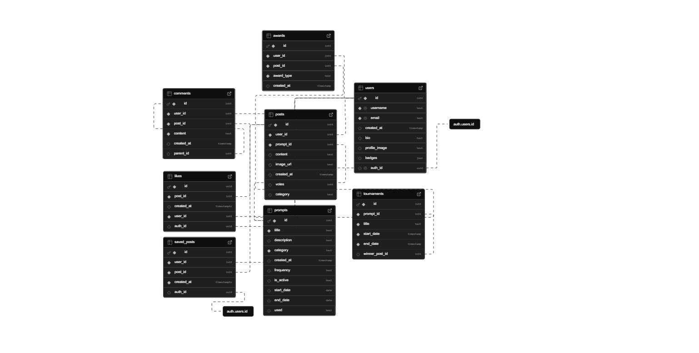

# Muse: Creative Community Prompt App

**Technologies and Features:** Kotlin (Jetpack Compose in Android Studio), Supabase, ImgurAPI, Camera Sensor

**Team Members:** Jeremy Lau, Rudolf Rissling

**[Project Proposal Presentation](https://docs.google.com/presentation/d/1y1cIMZUi84rIxTYbBRZkv12nnpZyd2N2_cxEGesJl_4/edit#slide=id.p).** 
**[Project Checkpoint Presentation](https://docs.google.com/presentation/d/1rR9ol3he5aJ5z11v6b9Mt69DvwdmCIGf3B3Rtbwba0s/edit?usp=sharing).**

## Table of Contents:
- [App Features](#app-features)
- [Design Decisions](#design-decisions)
- [Project Setup](#project-setup)
- [API Setup](#api-setup)
- [Database Setup](#database-setup)
- [Sensor Setup](#sensor-setup)
- [Multidevice Testing](#multidevice-testing)
- [Challenges Faced and Solutions](#challenges-faced-and-solutions)
- [User Testing and Feedback](#user-testing-and-feedback)
- [Initial Project Proposal](#initial-project-proposal)

## App Features
1. Uploading photos from the file library and taking photos with the camera sensor, adding a caption, and posting your post to your selection of 10 different creative communities:
   - Visual Arts
   - Programming
   - Engineering Projects
   - Photography
   - Creative Writing
   - Music Creation
   - Handmade Crafts
   - Culinary Arts
   - Filmmaking
   - Science Experiments
2. View other people's submissions in each of the creative communities
3. A Discovery page catered to you by an algorithm ranking system that takes in post creation date, number of likes, and number of comments
4. ImgurAPI integration to upload selected photo to Imgur (store link to Imgur image in our db to save space on our end by not having to save images, just text URLs)
5. Supabase secure storage for all users
6. Edit and delete your own posts/captions
7. Comment on other people's posts, reply to comments that you received, reply to comments on other people's posts - this is where we create the community where we can have discussions around people's creations
8. Liking other people's posts - this helps encourage others in the community to find motivation to continue creating cool things!
9. View and edit your own profile - profile image, bio, username etc.
10. Make account changes - e.g. changing password, change your email
11. Account creation, login, and logout
12. Splash screen loading screen - colorful gradient, begins user curiosity and creative flow
13. View saved posts as well as your own posts

## Design Decisions
1. Focus on building communities around creative outlets
   - Added a discovery page instead of tournaments/monthly competitions - we decided that our app's purpose is to inspire and share work with others, rather than making our app about who can create the best art
   - We show new posts at the top of each community, not just the most liked or most commented so far. We want to build communities around everyone who is contributing to the community.
2. Simple, easy to follow user flow
   - We want users to focus their time and energy on creating and interacting with others, so we have well-thought-out pages that provide key features to post creation, post viewing, and interactions
   - We manage our back stack well to ensure a smooth, seamless experience all around, and such that the user can never get lost and knows exactly where to go to find something.  
3. Opening the floor for discussion and connection
   - Creating Comments and Threadded Comments with replies was essential for our community-building process. Replying to any comment that sparks something you want to say brings our app to life. Originially, we were thinking about having just a long comment thread. After adding replies, even though it took a good amount of time to rethink our database setup, how comments are related to one another, and how we load our comments, we are much more satisfied with how this enables more freeflowing ideas between users.
4. Login and App Startup
   - Originally, we had a regular login screen with just a form
   - Adding animations with slow fade-in and fade-out of images and text, this created a sense for the user that they are now entering a new space - not just logging in
5. Portrait vs Landscape mode
   - For larger screens like a tablet, we use dp dimension cutoffs (e.g. 600) to display our UI differently
   - On tablets, we use more grid columns on the main page / all categories page
   - We also change the NavigationBar to a NavigationRail, as well as all the other UI components that were originally super stretched out on a larger screen
   - We decided not to change how comments and post feeds were displayed  on tablet vs landscape mode. We want the user to be able to see the posts as large as possible on their screen since the focus of the app is to look at people's creations, and if this sparks any conversation or curiosity, you have the option to click on the individual post and look at the comments under the post there. 

## Project Setup

Directory: 

MuseApp.kt (listed as CreativeCommunityApp.kt)  
MainActivity.kt 
Navigation.kt 
SupabaseClient.kt 

Components (folder) 
|-->  AchievementTiersDisplay.kt 
|-->  BadgeDisplay.kt 
|-->  BottomNavigation.kt 

Models (folder) 
|--> 	Comment.kt	 
|--> 	LikeModels.kt	 
|--> 	Post.kt	 
|--> 	RecommendationModels.kt	 
|--> 	UserModels.kt	 
|--> 	UserProfile.kt	 

Pages (folder) 
|--> 	AboutUsPage.kt	 
|--> 	CategoryFeed.kt	 
|--> 	DiscoveryPage.kt	 
|--> 	IndividualPostPage.kt	 
|--> 	LoginPage.kt	 
|--> 	MainPage.kt	 
|--> 	MyPostsPage.kt	 
|--> 	NewPostPage.kt	 
|--> 	ProfilePage.kt	 
|--> 	SavedPostsPage.kt	 
|--> 	UserPostsPage.kt	 
|--> 	ViewProfilePage.kt	 

UI/Theme (folder)  
|--> 	Color.kt	 
|--> 	Theme.kt	 
|--> 	Type.kt	 

Utils (folder)  
|--> 	LikeManager.kt	 
|--> 	PromptRotation.kt	 
MainActivity.kt 
`    ↓` 
LoginPage.kt - User either can create a new account or log into existing account; also on startup plays a startup animation welcoming the user to Muse 
`    ↓` 
Navigation.kt - takes in BottomNavigation.kt from components folder to either display NavigationBar or NavigationRail based on screen size 
`    ↓` 
MainPage.kt - Defaults to the main page where the user can select a creative category to explore, categories displayed in a responsive grid format 
`    ↓` 
CategoryFeed.kt - User can see and interact with posts within the community - liking the post, viewing comments, clicking on the comment button brings you to the IndividualPostPage, also changes prompts from PromptRotation, displays like counts using LikeManager - e.g. a listener 
`       ↓                                    ↓` 
IndividualPostPage.kt`                `NewPostPage.kt 
`       ↓` 
Can view a user profile 

Also:  
From the BottomNavigation.kt which is on every page, users can route to the following pages (e.g. from any page can navigate to the following pages:)
1. DiscoveryPage
2. MainPage
3. ProfilePage --> can go to MyPostsPage or SavedPostsPage from here, also contains badges and achievements for the user profile

**Notes:** 
Post.kt
- A reusable template for displaying posts, used in CategoryFeed.kt and IndividualPostPage.kt 

Comment.kt
- A reusable template for displaying comments, used in IndividualPostPage.kt 

NewPostPage.kt
- Includes both options for uploading a photo or taking a photo using the camera sensor
- ImgurAPI integration to upload the file to imgur for easy file storage, and we store the url to the Imgur photo in Supabase

## API Setup
We are using ImgurAPI to efficiently handle large amounts of image uploads from users as we are building a creative community based on user photo submissions of their work.

Notes about our setup:
- We leverage local.properties to hide our Imgur API key
- Make sure to create your own Imgur API key, and set it in local.properties file: e.g. IMGUR_CLIENT_ID= [YOUR API KEY]
- We added internet access permission in our AndroidManifest file, and load our secret key through our build.gradle (app) file 

## Database Setup
We are using Supabase as our database

Interactions with database so far: 
1. User account creation and registration, as well as logging in using an account
2. Categories page connected to the categorical keys inside the dB, so that each post now links to its category key, and we can fetch them and sort them, etc
3. Added submission storage into the dB. It now stores the image, links to the user and the prompt, stores date of creation, its category, etc
4. Submission fetching into post feed
5. Username and PFP fetching from the dB for the submissions and comments
6. Saving relationships between comments and users when a user creates a new comment
7. Updating the like count and comment count
8. Pulling weekly prompts for creative communities from Supabase
9. Updating saved post relationship between post and user
10. Badges and achievement tiers for users' profiles

Database Schema:

## Sensor Setup
We are using the camera sensor to enable users to take photos of their work to share with their creative community
- Took some time to get this set up, added functionality early in sprint 1

## Multidevice Testing
Tested on:
- Nexus 5 (API 30. Android 11.0 ("R")), portrait phone mode
- Medium Tablet API 31 (both landscape and portrait mode)
- Pixel 5 API 31 (portrait mode phone)

Notes: visually appealing UI design on both devices in both orientations, functionality remains the same.

## Challenges Faced and Solutions
- ImgurAPI integration
  - Kept running into errors
  - Trouble abstracting away our hidden key, initially we were able to use the key directly in our code, but to protect our API key for best practices, we needed to load it from our local properties and configure it using build.gradle - this took a bit of time to set up for both of us since we were trying different approaches. Once one of us figured this part out we pushed it and the other pulled so we were working with the same version of code. 
- Supabase setup
  - Designing and thinking out all the relationships between all of the data models/tables took a lot of time
  - Looking at our project in smaller sections and creating flow diagrams of how our users would use our app allowed us to identify different models and how they should be related to one another
- Camera sensor
  - Took some time to set up - resolved using forums, documentation, etc.
- Updating like counts - originally wanted to send a request for every time a person liked / unliked a request; with many users this would generate so many requests - so using a different approach. We now check every so often to see if the user liked any posts and then push those local changes / state / counts to supabase.
- Had some issues with UI - landscape vs portrait mode, needed to use configuration.screenWidthDp and that solved the issue - now can display different grid dimensions and NavigationRail/NavigationBar based on screen sizes
- A lot of text was hard to read based on UI changes - wanted to have backgorund images, ended up adding alpha color backgrounds
- Figuring out replying to comments - decided to add a "parent" field to comments, with original comments' parents being null, and when you reply to a comment, the replying comment "parent" field is the id of the comment it is replying to - this also allowed us to add details like indentation based on how many "parents" or how deep in the reply chain we got - this is more of a Reddit style approach to handling comment replies; using a recursive method to display all comments under a post - this also helps with indentation to visualize reply comment hierarchy
- Login page animations - ended up showing / hiding different UI elements based on booleans that we define, and then to "animate" we would interchange boolean variable updates with delays / waiting for the animation and then change the next variable to show the next UI element / so on and so forth. Using AnimatedVisibility for this. Using LaunchedEffect to run all of our logic and time delays inside a coroutine.
- Deleting a post - we have external references to the post in our comments and likes tables in Supabase, so we got tons of errors trying to delete a post. Ended up having to delete the likes and comments associated with the post first, then deleting the post itself so we were not left with any broken references.

## User Testing and Feedback

**<ins>Friend #1**</ins>  
**Feedback:**  
I really like the animations at the start - it feels like a real app haha. I'm trying to get more into drawing, I'm taking a drawing class right now so I like the idea of this app. It's a place where I can also share my work with others and maybe see what other people are doing. I use Instagram, interest, and other places to get inspiration for drawing, this could be another place to draw inspiration from - I like the app!  
**Suggested improvements:** 
Maybe have a way to add friends or follow people whose art that you like would be cool, maybe like a different feed for the people you are following and only their posts show up in that feed.   

**<ins>Friend #2</ins>**  
**Feedback:** 
I like the layout on the home screen with the categories, feels very organized - I know how the app works, pretty straightforward for a new user, I like that I can physically click and navigate into different communities - it feels better than maybe using a filter or search bar.  
**Suggested improvements:** 
Fade in could be a bit slower to get a better effect. Maybe choose a feed from different categories instead of going to each one - a tailored home page.   

**<ins>Friend #3</ins>**  
**Feedback:** 
I like that there's always new creative prompts for each week - it is another way to see how different people interpret each prompt in their own style and get inspiration from there. Great way to get people to share new posts by having a prompt where they can contribute to the creations of this week in the community.  
**Suggested improvements:** 
Maybe you could have a grid view of posts on the tablet view - this could look kind of like Pinterest how they do it - doesn't have to be strictly a vertical feed. Also since you have a new weekly prompt, maybe be able to sort by previous weeks' prompts to see other weeks creations and only show the current week's posts in the feed or something.  

## Initial Project Proposal

## 1. App Concept

Our app delivers daily or weekly creative prompts to our users. Users can choose a topic of their interest - such as drawing, photography, engineering, coding, painting, or music. For their selected interest or creative hobby, the app will prompt them with a custom challenge - for example, “draw a castle only using circles” or “paint a park nearby.” Users can upload photos or text of their creations to their community, and other users can provide feedback to them using for example comments or awards. There can also be judging challenges or voting competitions where people vote for the best creative creation. Winners can expect to receive virtual trophies or badges that they can display on their profile.

## 2. App Purpose

Our app encourages people to invest time into a daily or weekly creative activity, and help build a community around their hobbies or passions. Daily or weekly practice over time helps them develop their skills, and our app also allows them to connect with like minded people and get inspired by one another to further develop their craft. It is a fun way to work on something that you enjoy with other people - it’s like a virtual drawing community or photography community - everyone can help one another get better at something they enjoy.

## 3. Selected Sensor

We will leverage the camera sensor on our mobile devices to allow users to take photos of their creative creations. This is most helpful for categories like drawing, photography, and painting.

## 4. Selected API

We plan to use either Imgur API or ImageKit API to handle easy image upload and sharing. If image upload to a database is quick without an API, we can also use OpenAI API or a free API to create new random creative prompts for users.

## 5. Selected DB

For the database, we’re going with Supabase, because it gives us a lot of flexibility for how we structure data like users, prompts, submissions, and votes. It also supports file storage for images, authentication out of the box, and a clean way to manage relational data like prompt → submission threads or tournament entries. Plus, it’s free and easy to scale if we ever want to take the project further.

## 6. Target Devices

We decided to go with Android phones and Android tablets to cover the majority of our user base. Since most of the creative challenges will involve uploading photos or digital art, we want to make sure the app works well on phones (for taking and uploading images) and tablets (for sketching, drawing, and viewing submissions on a larger screen). This way, users get the best experience no matter how they interact with the app.

## 7. Initial Wireframes / Sketches

On the presentation
